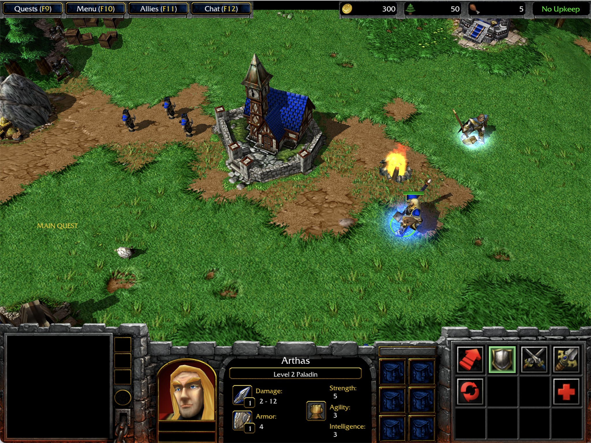
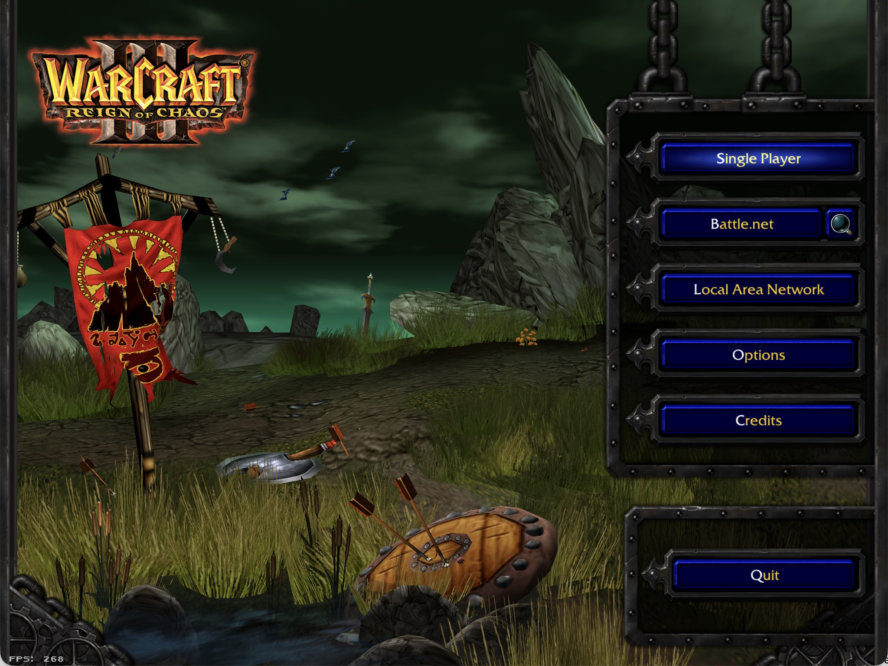
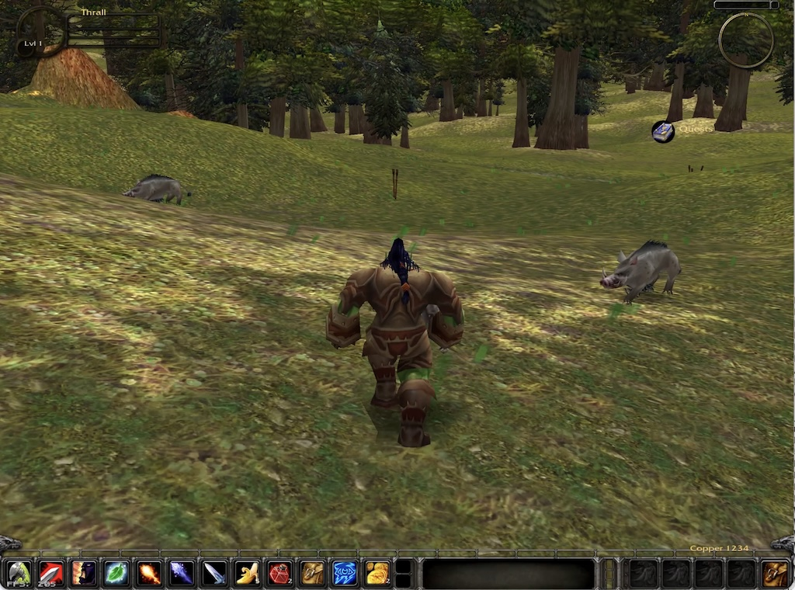

<p align="center">
  
</p>

# OpenWarcraft3

OpenWarcraft3 is an open-source, Quake-style engine and compatibility project for Blizzard-era game data. Warcraft III is the primary playable target; StarCraft II and World of Warcraft provide additional format and renderer targets.

[](LICENSE) [](https://github.com/corepunch/open-realm/actions/workflows/c-cpp.yml) [](#) [](#) [](https://discord.gg/MxkUMWsKGs)

The project does not include retail game data. Use it only with data you legally own. OpenWarcraft3 is not affiliated with Blizzard Entertainment.

<p align="center">
  
  
  <a href="https://youtu.be/EcuoDoOztjA">
  
  </a>
</p>

## Current targets

- **Warcraft III** — `openwarcraft3`, the main development target, including the client/server runtime, JASS, SLK/profile data, FDF UI, campaign flow, maps, fog, units, and networking.
- **World of Warcraft** — `openwow`, an exploratory M2/WMO/DBC/MPQ and UI target with a Lua-backed interface.
- **StarCraft II** — `opensc2`, an exploratory M3/SC2Map/SC2Layout target.

The shared runtime contains the client, server, renderer backend, networking, archive loading, console/cvars, sound, and math libraries. Game-specific code lives under `games/<game>/` and is connected through Quake 2-style import/export tables.

## Download

Pre-built binaries and Flatpak bundles are available from the [latest release](https://github.com/corepunch/open-realm/releases/latest). CI artifacts are published by the [CI workflow](https://github.com/corepunch/open-realm/actions/workflows/c-cpp.yml). Neither releases nor CI artifacts contain retail assets.

For Flatpak and Steam Deck packaging, see [Flatpak And Steam Deck Packaging](docs/flatpak-steam-deck.md).

## Build

The native build requires a C compiler, `make`, SDL2, and system OpenGL (or GLES3 on supported Linux systems). MPQ loading and most format tooling are provided by vendored or in-tree code.

macOS:

```bash
brew install sdl2
```

Ubuntu/Debian:

```bash
sudo apt-get install build-essential libsdl2-dev
```

Windows builds use MSYS2/MinGW or Visual Studio with SDL2 development libraries.

```bash
git clone https://github.com/corepunch/open-realm.git
cd open-realm
make build
```

Useful targets:

```bash
make openwarcraft3       # Warcraft III executable
make openwow             # World of Warcraft executable
make opensc2             # StarCraft II executable
make tools               # Asset/archive diagnostic tools
make test                # Generate fixtures and run tests
make test-ui             # Warcraft III UI parser/layout tests
```

The default build is diagnostic. Select release mode and renderer settings with:

```bash
make clean && make BUILD=release openwarcraft3
make clean && make BUILD=release GL_BACKEND=gles3 MSAA=0 openwarcraft3
```

Supported settings are `BUILD=debug|release`, `GL_BACKEND=gl|gles3`, `MSAA=0|2|4|8`, and `GLSL=120|140|150`. Run `make clean` when changing these values. See [Build And Renderer Platforms](docs/build-and-renderer-platforms.md).

## Run with game data

Point the executable at a Warcraft III installation containing its MPQ archives:

```bash
build/bin/openwarcraft3 -data "/path/to/Warcraft III"
```

The directory is scanned for top-level MPQs and an optional loose `Maps/` directory. The Makefile also supports `WC3DATA`:

```bash
WC3DATA="/path/to/Warcraft III" make run
```

Useful examples:

```bash
build/bin/openwarcraft3 -data "/path/to/Warcraft III" +menu_main
build/bin/openwarcraft3 -data "/path/to/Warcraft III" +map 'Maps/Campaign/Orc01.w3m'
build/bin/openwarcraft3 -data "/path/to/Warcraft III" -vid_modes +com_frame_limit 10
```

Open the in-game Quake-style console with backtick/tilde. Use `build/bin/mpqtool` to inspect archives:

```bash
build/bin/mpqtool -mpq "/path/to/Warcraft III/War3.mpq" ls Maps/Campaign
```

## Run on iPad

The iPad build needs macOS with Xcode (for the iOS SDK, `xcrun`, and `devicectl`), CMake, and no Xcode project. SDL2 is downloaded and built automatically on first use.

1. Connect the iPad by USB (or pair it over Wi-Fi in Xcode's *Devices and Simulators*), unlock it, and enable *Developer Mode* in Settings > Privacy & Security.
2. Make sure a development signing certificate and a matching iOS development provisioning profile for `com.openwarcraft3.warcraft3` (or a wildcard) are installed. Signing in to Xcode with your Apple ID and letting it create one for any app is enough.
3. Build, sign, install, and launch:

```bash
make ipad-deploy
```

With several devices attached, list them and pick one; pass `TEAM`, `PROFILE`, or `BUNDLE_ID` to override signing:

```bash
make list-devices
make ipad-deploy DEVICE="iPad name or identifier" TEAM=ABCDE12345
```

4. Copy `War3.mpq` and `War3Local.mpq` (plus `War3x.mpq`/`War3xLocal.mpq` for The Frozen Throne) into *On My iPad > OpenWarcraft3* with the Files app or Finder, then relaunch. Without them the app shows a "data not found" alert.

The iPad must be unlocked for the launch step. `make ipad-run` does the same in an iPad simulator. See [packaging/ipad/README.md](packaging/ipad/README.md) for details.

## Tests and diagnostics

`make test` generates deterministic fixture archives under `build/tests/` and runs engine, parser, persistence, and format tests. For Warcraft III UI changes, run `make test-ui`. Useful tools include `mdxtool`, `maptool`, `m2tool`, `mpqtool`, `blp2jpg`, `blpgen`, and `mdxgen`. Bounded runtime diagnostics use `+com_frame_limit N`.

## Documentation

- [Architecture](ARCHITECTURE.md) — module boundaries and API contracts
- [Runtime configuration](docs/architecture/runtime.md) — paths, cvars, and startup order
- [Rendering scene workflow](docs/rendering-scene-workflow.md) — launching maps and model scenes
- [UI authoring](docs/ui-authoring.md) — FDF, bindings, and UI tests
- [WC3 gameplay documentation](docs/games/warcraft-3/gameplay-features.md)
- [Diagnostic tools](docs/diagnostic-tools.md)
- [Contributing](CONTRIBUTING.md)

## License

This project is licensed under the [MIT License](LICENSE).
