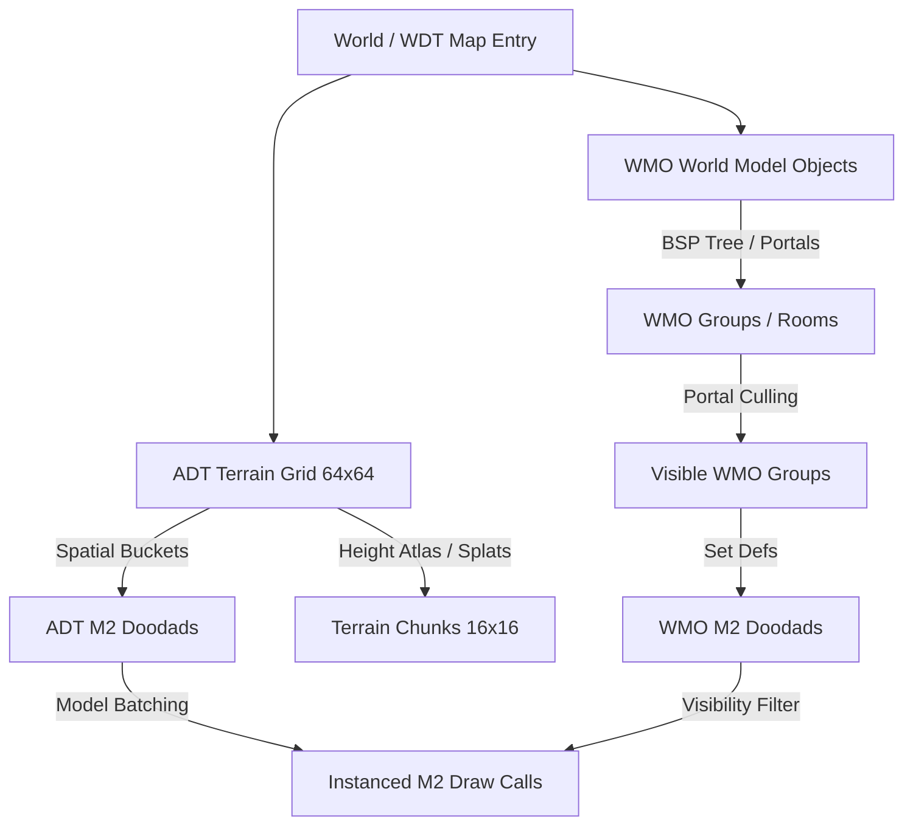

# World of Warcraft Renderer Performance & Architecture (WOWPERF)

Analysis of World of Warcraft (2004–2008 Classic era) rendering performance, client/server bottleneck isolation, embedded ARM device diagnostics, and an architectural optimization program targeting 200+ FPS minimum on modern workstations.

## FPS Bottleneck Isolation Ladder

Profile measurements taken in the Human starting zone (`playercreate` / Northshire Abbey) by disabling rendering subsystems cumulatively via cvars and toggles:

| Configuration | Local FPS / Rate | FPS Delta | Bottleneck & Subsystem Overhead |
| :--- | :---: | :---: | :--- |
| **Full rendering** | 103–107 FPS | Baseline | Complete terrain, WMO structures, M2 doodads, entities, particles, grass, HUD/minimap. |
| **HUD / Minimap off** | 109–112 FPS | +5 FPS | 2D UI rendering overhead (ConsoleUI / FrameXML & minimap quad pass). |
| **Entities / Shadows / Particles off** | 117–119 FPS | +7 FPS | Creature/player M2 transforms, shadow splat batching, particle emitter updates. |
| **Grass also off** | 117–120 FPS | +1 FPS | Instanced ground effect grass rendering (`WOW_GRASS_*` path is already highly optimized). |
| **Doodads also off** | **~304 FPS** | **+184 FPS** | **Primary Bottleneck**: M2 doodad model submission & instancing setup. |
| **WMOs also off** | **~389 FPS** | **+85 FPS** | **Secondary Bottleneck**: WMO building group batching & geometry submission. |
| **Terrain / FOW off (zero draws)** | 610–623 FPS | +224 FPS | ADT terrain splat layers, height rendering, fog-of-war. Pure frame engine ceiling. |
| **`r_norefresh 1`** | **~177,000 loops/s** | N/A | Total render pipeline bypass. Engine frame loop & client network/event throughput limit. |

### Key Isolation Takeaways
1. **Doodad rendering is the single largest bottleneck** in the scene, consuming over 60% of frame time (removing doodads jumps FPS from ~120 to ~304).
2. **WMO structure rendering is the second largest cost**, accounting for ~85 FPS (removing WMOs jumps FPS from ~304 to ~389).
3. **Grass, entities, and UI are relatively lightweight**, contributing less than 15 FPS combined on modern hardware.

---

## Server Isolation Under `r_norefresh 1`

To determine whether local server simulation or network loopback packets impair client framerates, the server simulation and snapshot pipeline were benchmarked under full render bypass (`r_norefresh 1`):

| Server Component Isolation | Loop Rate | Throughput Delta | Analysis |
| :--- | :---: | :---: | :--- |
| Baseline `r_norefresh 1` | ~177,000 loops/s | Baseline | Standard local server + client loopback processing without rendering. |
| Game simulation disabled | ~175,000 loops/s | 0% | Server entity `think` functions & world updates add negligible CPU overhead. |
| Snapshot construction disabled | ~177,000 loops/s | 0% | Server delta snapshot assembly (`SV_BuildClientFrame`) is negligible. |
| Snapshot writing / delivery disabled | ~303,000 loops/s | +71% | UDP packet encoding, socket writing, and loopback socket read overhead. |
| Packet polling also disabled | ~320,000 loops/s | +5% | System socket `poll`/`recvfrom` kernel calls. |

### Conclusion on Server vs. Client Overhead
- **Server simulation is not responsible for low framerates.** The server thread/loop easily processes >175,000 ticks/sec locally.
- **Loopback socket messaging** becomes noticeable only at extreme iteration rates (>177k FPS), adding ~70% cost at 300,000 loops/s, but is irrelevant at normal game framerates (100–300 FPS).
- The low framerate is **exclusively client rendering and driver submission bound**.

---

## Low-Power Embedded Diagnostic (RG40xx / Handheld ARM)

To diagnose embedded ARM handheld devices (e.g. RG40xx / Anbernic devices yielding 3–4 FPS under full rendering), run the headless `r_norefresh` diagnostic to isolate CPU loopback limits from GPU/OpenGL ES driver constraints:

```bash
build/bin/openwow -data data/world-of-warcraft \
  +set wow_playerinfo '\race\Human\sex\Male\class\1\appearance\0' \
  +set r_norefresh 1 +set r_stats 1 \
  +map playercreate +com_frame_limit 300000
```

### Diagnostic Output & Interpretation
Look for the console log output:
```
[R_NOREFRESH] loops=...
```
- **If `loops/s` > 10,000 on RG40xx**: The CPU, memory, and engine loop can easily handle high framerates. The 3–4 FPS limitation is 100% GPU / GL ES driver / draw-call submission bound.
- **If `loops/s` < 1,000 on RG40xx**: The embedded platform is CPU-bound or experiencing thread/socket polling stalls independent of graphics.

---

## Detailed Bottleneck Analysis: WMO-Owned Doodad Batching

### Root Cause & Instrumentation
In `games/world-of-warcraft/renderer/wow/r_wowmap_wmo.c` and `r_wowmap_objects.c`:
1. **Model-Based Batching**: M2 doodad instances are grouped into per-model batches (`wowDoodadModel_t`) to upload matrix arrays for instanced drawing.
2. **The Visibility Gap**:
   - Outdoor ADT doodads use spatial bucket culling (`Wow_BucketDoodadInstance`, `WOW_DOODAD_BUCKET_SIZE = 128.0f`) to limit candidate doodads within `WOW_DOODAD_DRAW_DISTANCE` (450 units).
   - In contrast, WMO-owned doodads (`Wow_QueueWmoDoodads`) attached to interior buildings (e.g., Northshire Abbey structure) iterate all `doodad_defs` in the WMO set and queue them directly into model batches **without checking parent WMO frustum/portal visibility**.
3. **Impact**: In the Human starting view (`playercreate`), roughly **608 avoidable draw submissions / instance entries** are queued every frame for interior or occluded doodads inside WMOs that are behind walls or outside the view frustum.

### Optimization Target
- Implement parent WMO instance bounding box frustum culling before calling `Wow_QueueWmoDoodads`.
- Implement WMO group portal culling so doodads inside hidden WMO interior groups (`MOGP`) are skipped during scene submission.

---

## Classic WoW (2004–2008) Rendering Architecture Overview

Public primary sources (Blizzard *Engineer's Workshop* articles, GDC technical talks, public patents, and open-source engine implementations such as OpenMW / WoWee) reveal how early World of Warcraft achieved smooth seamless world rendering on 2004-era hardware (Pentium 4, GeForce 4 / FX 5200):



### 1. Spatial Paging & ADT Grid
- Maps are divided into a 64x64 grid of ADT tiles (each 533.33 yards on a side).
- Each ADT contains 16x16 map chunks (`MCNK`), each with 145 heightmap vertices (9x9 outer grid + 8x8 inner grid) and up to 4 alpha-splatted texture layers.
- Object placement is split into terrain doodads (`MDDF` chunk) and WMO instances (`MODF` chunk).

### 2. WMO (World Model Object) Portal & BSP Culling
- WMOs represent non-terrain structures (inns, castles, dungeons, bridges).
- Large WMOs are split into WMO Groups (`MOGP`), each representing a distinct room, exterior shell, or section with its own AABB and BSP tree (`MOBN`).
- **Portals (`MOPR`)**: Portals connect adjacent WMO group rooms and link interior rooms to exterior terrain.
- **Occlusion Contract**: When the camera is outside a building, portal frustums cull interior WMO rooms and all doodads (`MODD`) attached to those rooms. Interior rooms are only drawn if their connecting portals intersect the camera view frustum.

### 3. M2 Doodad Instancing & State Batching
- M2 models (trees, lanterns, furniture, weapons) are instanced across the world using scale, rotation, and translation matrices.
- Early client engines sorted M2 instances by material/texture ID and instance batch buffers to submit multiple instances in single GPU draw calls, minimizing context switches and uniform state transfers.

---

## Optimization Roadmap to 200+ FPS

To lift performance from ~105 FPS to >200 FPS on local hardware and improve low-end embedded rates:

1. **WMO Parent & Group Visibility Filtering**:
   - Filter `Wow_QueueWmoDoodads` by parent WMO instance bounding box frustum check.
   - Cull doodads whose parent WMO group is hidden by portal / BSP visibility.
2. **Coalesced Instancing Uniform Uploads**:
   - Pack M2 transformation matrices into single uniform array batches (`glUniformMatrix4fv` or instanced VBOs) per unique model, eliminating single-doodad draw calls.
3. **ADT Patch & Chunk Frustum Culling**:
   - Early-out invisible ADT terrain chunks using bounding-box frustum checks before issuing multi-layer alpha splat passes.
4. **Benchmarking & Regression Testing**:
   - Run bounded verification (`+com_frame_limit 100`) after each change to verify framerate improvement.

## RG40xx post-change address-map audit (2026-08-28)

The [reported WoW gist](https://gist.github.com/sookyboo/f4ba5ba29abbd7d2c074b92f8b6ad46d) is a sequence of
`addr2line` commands and resolved source locations, not the originating sampled profile. It contains no sample counts,
percentages, timestamps, call graph, device/driver frames, build revision, or tested scene. Repeated addresses are not
weights. The file proves that terrain/WMO drawing, instanced doodads, dynamic M2 bones, entity shadows, UI, snapshots,
quest customization, AI floor queries, and routing were reachable; it cannot rank them or quantify an FPS opportunity.

Current-source inspection identifies these measurement targets:

1. **WMO-owned doodad visibility.** `R_DrawWorld` builds one persistent instance buffer per M2 model containing doodads
   from every loaded WMO and submits every non-empty buffer every frame. Parent WMO and visible-group results therefore
   cannot remove hidden instances. Parse authoritative group `MODR` doodad references, partition instance data by WMO/
   group/model, and submit only groups selected by the existing WMO visibility pass. Do not infer group ownership from
   position or add distance-only data fallbacks.
2. **Renderer terrain-height lookup.** `Wow_TerrainHeightAtPoint` linearly walks `wow_world.chunks` for each query. Blob
   shadows query once per visible entity; fitted selection/special splats query every lattice vertex. Maintain a direct
   chunk-pointer grid alongside the existing height-atlas coordinates so world XY selects the owning MCNK in O(1).
3. **Duplicate dynamic M2 poses.** `M2_RenderModel` evaluates bones, then an overhead quest marker immediately calls
   `M2_EntityAttachmentPosition`, which evaluates the same pose again. The later name-label pass can evaluate it a third
   time. Cache the resolved PlayerName attachment per entity and render frame after the model pose is built; invalidate
   on model/frame/oldframe/interpolation changes and test marker plus label consumers.
4. **Quest-giver snapshot lookup.** `Wow_CustomizeEntity` can make multiple full scans of 1,787 generated quest-giver
   rows per quest NPC and client snapshot. Generate a physical-giver index keyed by authoritative map/position identity,
   then evaluate only that giver's quest chain against the bounded player quest log.

`closest_pathable_node`, `SV_BuildClientFrame`, UI drawing, and ordinary creature AI also appear, but the address map
does not justify changing them. `closest_pathable_node` is normally an order-time correction rather than a frame loop;
server isolation already found snapshot/simulation cost negligible locally; and `R_EndFrame` may represent GPU/swap
waiting that an application-only address list cannot expose. Obtain `perf report --stdio` plus `perf script` or folded
stacks from a fixed scene before implementing beyond the source-confirmed duplicate/linear work above.

---

## Related Documentation

- [Terrain And World Rendering](terrain-and-world-rendering.md) — WDT/ADT layout, terrain splats, heightmap format.
- [Data Loading](data-loading.md) — MPQ archive structure and file resolution.
- [M2 And Character Display](m2-and-character-display.md) — M2 model format, skin sections, and submesh rendering.
- [WC3 Performance Hot Spots](../warcraft-3/performance.md) — MDX bone setup, shadow batching, client/server active entity indexing.
- [Engine Architecture](../../ARCHITECTURE.md) — Server/client module boundaries and network state contracts.
